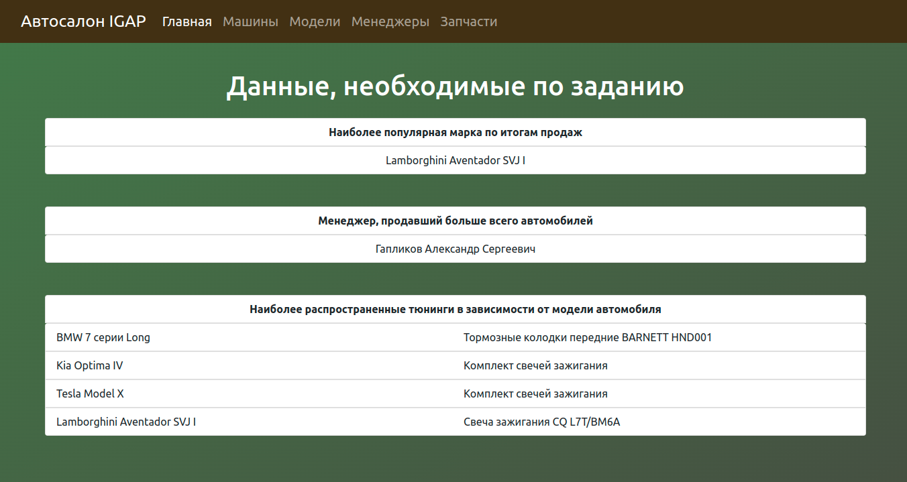

# Car Dealership Information System

## Описание

Информационная система для салона автомобилей. \
Проект написан на Spring Boot \
Взаимодействие с бд (PostgreSQL) осуществляется через Spring Data JPA. \
В качестве фронта используются представления с шаблонизатором Thymeleaf, а также Bootstrap 5. \
Приложение реализует все основные функции CRUD. \
\
Проект развернут на своем сервере http://car-dealership.igapserver.ru/ (сервер может быть выключен, нет денег для постоянного содержания, хехе) \
Поднят nginx для корректного перенаправления трафика

## Автор

Гапликов Александр

## История версий

*  2.3.0 - Проект закончен. Обновлена домашняя страница, выведена отчетная информация по данным БД.  \
   
*  2.2.0 - Реализован функционал добавления, изменения и удаления автомобилей, менеджеров и запчастей. Добавлена возможность добавлять и удалять запчасти конкретным машинам. \
   
*  2.1.0 - Реализован функционал добавления, изменения и удаления моделей автомобилей. \
   
*  2.0.0 - Полностью обновлен внешний вид интерфейса. Добавлена верстка на Bootstrap 5. \
   
*  1.2.0 - Добавлен функционал вывода на экран списка машин и запчастей. Добавлена домашняя страница для удобство.
*  1.1.0 - Добавлены все необходимые модели приложения. Реализован функционал вывода на экран списка менеджеров и моделей автомобилей.
*  1.0.0 - Создано базовое Spring Boot приложение
*  Начальный коммит